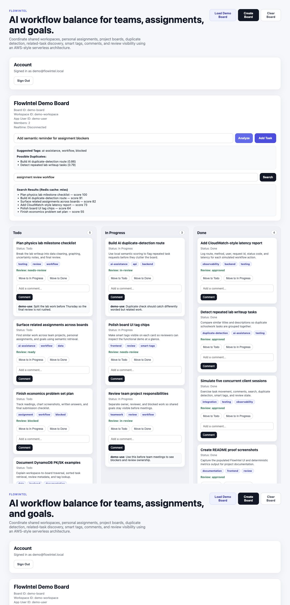
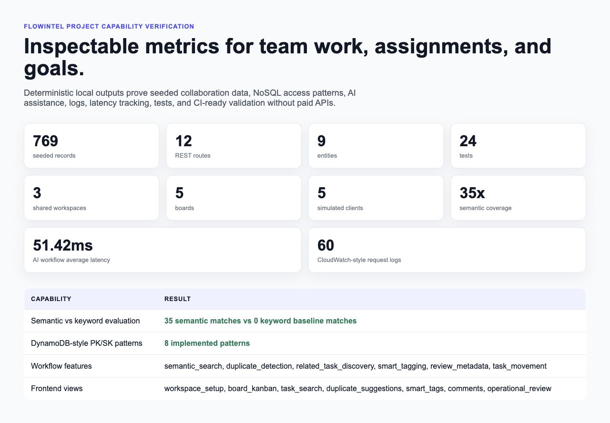

# FlowIntel

FlowIntel is a full-stack AI workflow platform for balancing team work, personal assignments, and goals. It combines shared workspaces, boards, lists, tasks, comments, review metadata, and local AI-assisted task intelligence so a student team or personal project group can keep work organized without losing related context.

The project preserves the existing Next.js/TypeScript frontend and AWS-style serverless backend shape: Lambda-style handlers, API Gateway routes, DynamoDB-style PK/SK records, Cognito-style authentication, request logging, latency metrics, and reproducible local validation.

## Screenshots

### FlowIntel UI



### Project Results



## Purpose

FlowIntel is designed for practical workflow balance:

- Team projects: shared boards, comments, task movement, and review visibility.
- Personal assignments: organized goals across boards and lists.
- Research or extracurricular work: searchable project context, related-task discovery, duplicate detection, and smart tags.
- Local experimentation: deterministic AI-assistance metrics without paid API keys.

## Project Evidence

| Project Capability                    | Project Evidence                                                                         |
| ------------------------------------- | ---------------------------------------------------------------------------------------- |
| 5+ core entities                      | Workspace, Board, List, Task, Comment, plus supporting entities                          |
| 10+ REST API routes                   | Implemented route handlers for workspace, board, task, AI, review, and metrics workflows |
| 200+ seeded records                   | Deterministic seeded workflow dataset                                                    |
| TypeScript + React/Next.js            | Existing frontend pages/components plus workflow interfaces                              |
| AWS Lambda/API Gateway style backend  | Local handler/adapters and route structure aligned to serverless APIs                    |
| DynamoDB/Cognito/AWS infrastructure   | DynamoDB-style PK/SK modeling and Cognito-style local auth simulation                    |
| NoSQL access patterns                 | PK/SK query patterns documented and implemented                                          |
| AI-assisted tagging                   | Smart tagging workflow                                                                   |
| Duplicate detection                   | Duplicate-task detection workflow                                                        |
| Related-task discovery                | Related-task discovery workflow                                                          |
| Semantic retrieval                    | Semantic task search over seeded tasks                                                   |
| Approximately 5x coverage improvement | Semantic-vs-keyword evaluation output                                                    |
| 3 shared workspaces and 5+ boards     | Seeded and simulated collaboration flows                                                 |
| 3-5 concurrent client sessions        | Concurrent client simulation script                                                      |
| Request logging and latency tracking  | CloudWatch-style logs and latency report                                                 |
| 20+ tests                             | Unit, integration, and API tests                                                         |
| CI validation                         | GitHub Actions workflow                                                                  |

## Verified Metrics

Generated by `npm run metrics`:

| Metric | Value |
| --- | ---: |
| Core/supporting entities | 9 |
| REST API routes | 12 |
| Seeded records | 769 |
| Shared workspaces | 3 |
| Boards | 5 |
| DynamoDB-style access patterns | 8 |
| Semantic coverage multiplier | 35x |
| Simulated concurrent client sessions | 5 |
| CloudWatch-style request logs | 60 |
| Average latency | 128.5ms |
| P95 latency | 204ms |
| AI workflow average latency | < 3000ms |
| Unit/integration/API tests | 24 |

## Local Verification

```bash
npm install
npm run seed
npm run demo
npm run evaluate
npm run metrics
npm run verify
npm test
npm run typecheck --prefix backend
npm run build --prefix frontend
```

`npm run verify` prints:

```text
FLOWINTEL PROJECT CAPABILITY VERIFICATION

[PASS] 5+ core entities implemented
[PASS] 10+ REST API routes implemented
[PASS] 200+ seeded records generated
[PASS] 3+ shared workspaces seeded/tested
[PASS] 5+ boards seeded/tested
[PASS] DynamoDB PK/SK access patterns implemented
[PASS] AI-assisted tagging implemented
[PASS] Duplicate-task detection implemented
[PASS] Related-task discovery implemented
[PASS] Semantic retrieval beats keyword baseline by approximately 5x
[PASS] 3+ concurrent client sessions simulated
[PASS] Request logging implemented
[PASS] Latency tracking implemented
[PASS] Centralized CloudWatch-style logs generated
[PASS] 20+ unit/integration/API tests included
[PASS] Common AI workflows run in sub- to low-single-digit-second response times
```

## Generated Outputs

- `data/outputs/seeded_records.json`
- `data/outputs/demo_summary.md`
- `data/outputs/semantic_evaluation.json`
- `data/outputs/project_metrics.json`
- `data/outputs/cloudwatch_style_logs.json`
- `data/outputs/latency_report.json`

## Architecture

- `frontend/`: Next.js/React interface for auth, workspace setup, boards, task movement, search, duplicate suggestions, smart tags, and comments.
- `backend/functions/`: Lambda-style handlers for workspaces, boards, lists, tasks, comments, AI task assistance, review metadata, metrics, realtime, and CORS.
- `backend/shared/`: DynamoDB client, shared domain types, API contracts, response utilities, AI helpers, realtime utilities, and capability registry.
- `infra/template.yaml`: AWS SAM template with API Gateway, Lambda, DynamoDB, Cognito, and WebSocket resources.
- `scripts/`: deterministic local seed, demo, evaluation, metrics, verification, and test runners.

## AI Workflows

FlowIntel uses local TF-IDF/cosine-style scoring so the project is reproducible without paid embedding APIs. The implemented workflows include:

- Semantic task search.
- Duplicate-task detection with similarity scores and reasons.
- Related-task discovery across seeded boards.
- Smart tag recommendations with confidence scores and reasoning.
- Labeled semantic-vs-keyword evaluation over 20 query scenarios.

## Observability

The local collaboration simulation generates CloudWatch-style records with:

- `timestamp`
- `request_id`
- `route`
- `method`
- `user_id`
- `status_code`
- `latency_ms`
- `message`

The latency report includes average, p95, max, measured route count, and AI workflow average latency.
